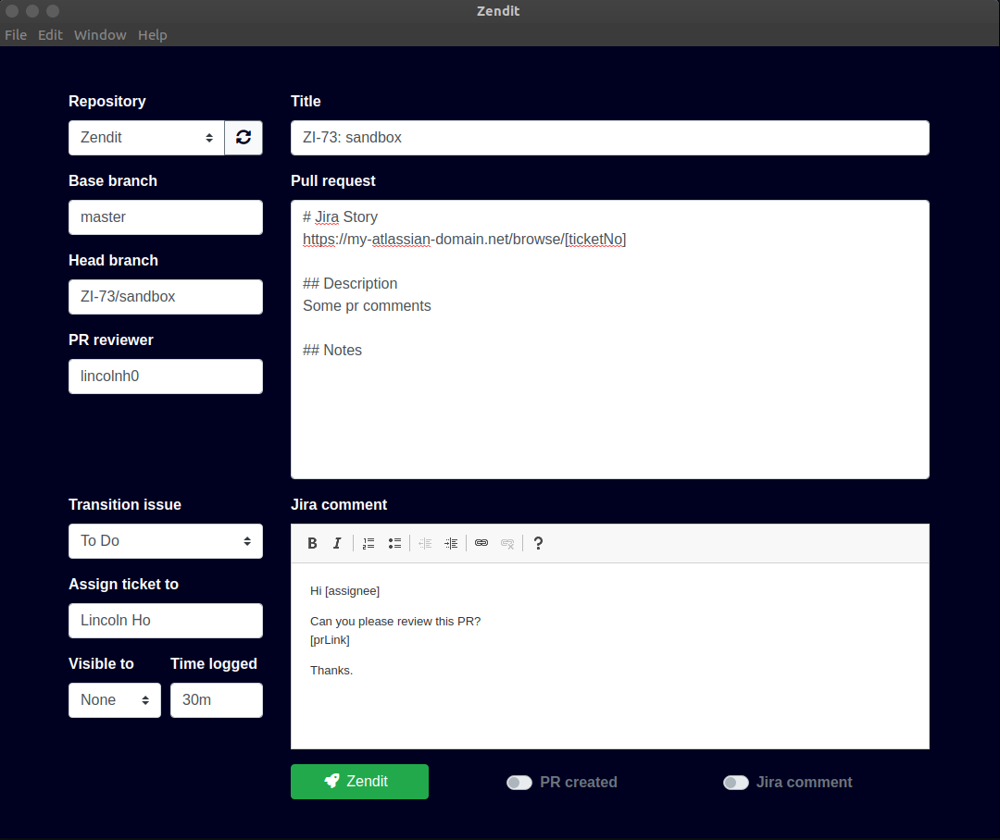

# Zendit
Zendit is an attempt to loosely integrate workflow that implements both Jira and Github. Through a single interface, pull requests can be drafted and an automatic comment will be made tagging the code reviewer on the respective Jira ticket.

## Framework
This project is built using electronJS with both Bootstrap 4 and 5 on the front end. 

## Pre-requisites + installation
Download the release or compile it yourself.

`yarn electron-packager .` - to package with electron-packager

`yarn package` - to package with electro-forge

You will need both a Jira API token and a Github token with writing permissions to repos and/or organizations repo.

## Comparison 

#### Traditional workflow of 
1. pushing local changes on terminal
2. open a pull request on Github
3. edit repo's PR template / paste + edit own template
4. assign reviewer
5. save PR
6. copy PR url
7. open Jira issue
8. assign issue to reviewer
9. comment with PR link

Takes around 1.5 minute by a very prepared user (me)

#### New workflow
1. push local change on terminal
2. choose head branch from ui
3. edit own PR template
4. assign reviewer
5. edit own comment template (Or not with use of tokens)
6. assign issue to reviewer
7. publish

Takes around 20 seconds, minus the slowing down from loading both websites.

## Roadmap
- [ ] Implement regex for converting branch names to issue keys
- [ ] More extensive HTML to Jira's ADF parsing
- [x] Extend visibility option (currently limited to group)
- [x] Ability to log time on issue

## FAQ
### Any reason why I should switch?

MVP took ~15 hours of development, which will be worth it once 1080 pull requests are created with this method. The more people that use this, the quicker we can reach this goal.

### Surely using an official plugin is more secure and safer?

Yes.

